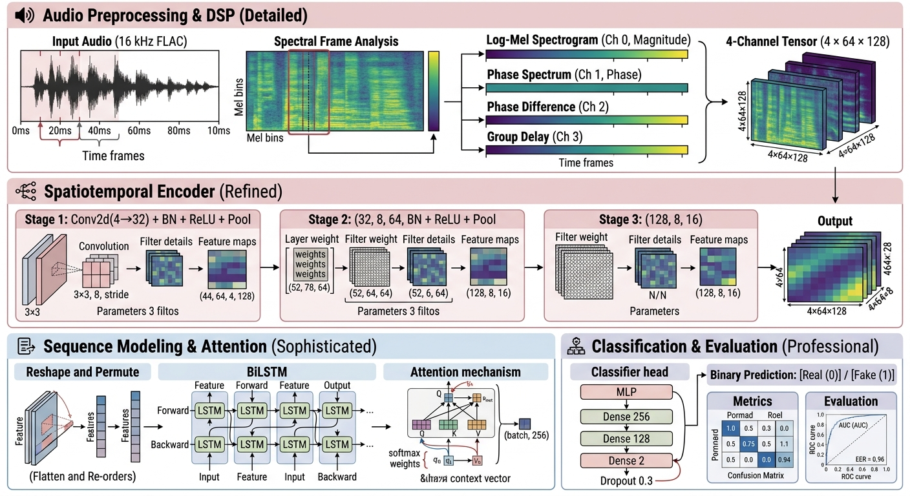

# 🎙️ AI Audio Deepfake Detection System

A **hybrid DSP + Deep Learning** framework for detecting AI-generated (deepfake) speech, achieving **89.10% accuracy** on the official ASVspoof 2019 evaluation split with **13 unseen attack types (A07–A19)**.

[](https://python.org)
[](https://pytorch.org)
[](LICENSE)
[]()

---

## 📋 Table of Contents

1. [Overview](#1-overview)
2. [Key Results](#2-key-results)
3. [Architecture](#3-architecture)
4. [Project Structure](#4-project-structure)
5. [Quick Start](#5-quick-start)
6. [Dataset](#6-dataset)
7. [Experiments & Findings](#7-experiments--findings)
8. [Visual Evidence](#8-visual-evidence)
9. [Tech Stack](#9-tech-stack)
10. [Research Log](#10-research-log)
11. [Roadmap](#11-roadmap)
12. [License](#12-license)
13. [Contact](#13-contact)

---

## 1. Overview

Recent advances in Text-to-Speech (TTS) and Voice Conversion (VC) systems — Tacotron, FastSpeech, VITS, Bark, XTTS — can synthesize speech nearly indistinguishable from human voices. This project builds a forensic-grade detector that identifies subtle artifacts introduced by these synthesis engines.

The system combines **classical Digital Signal Processing (DSP)** with **deep learning** to extract and classify both magnitude and phase-domain features from raw audio.

---

## 2. Key Results

### 2.1 Model Performance

| Model | Test Split | Accuracy |
| :--- | :--- | :--- |
| **CNN + BiLSTM (Proposed)** | ASVspoof 2019 Eval (A07–A19, unseen) | **89.10%** |
| Random Forest + FFT | ASVspoof 2019 Eval | 86.75% |
| 1D CNN on FFT | ASVspoof 2019 Eval | 86.75% |
| 2D CNN on Spectrograms | ASVspoof 2019 Eval | 86.75% |

### 2.2 Per-Class Performance

| Metric | Value |
| :--- | :--- |
| Real (Bonafide) Recall | **99.40%** |
| Fake (Spoof) Recall | **78.60%** |
| False Positive Rate | **0.6%** (Security-First Bias) |

---

## 3. Architecture

### 3.1 End-to-End Pipeline


*DSP feature extraction → 4-channel tensor → CNN encoder → BiLSTM + Attention → Classifier.*

### 3.2 Design Rationale

- **CNN:** Extracts local spectral patterns (spikes, glitches, unnatural smoothness).
- **BiLSTM:** Captures forward and backward temporal context (fake voices have unnatural rhythm).
- **Attention:** Learns which time frames matter most (deepfake artifacts often appear in transitions).
- **Multi-Channel Input:** Combines complementary magnitude and phase information.

---

## 4. Project Structure

```text
audio_deepfake_detection/
├── data/                              # ASVspoof 2019 dataset (gitignored)
├── notebooks/                         # Exploratory Jupyter notebooks
├── src/
│   ├── preprocessing/                 # Dataset loader with defensive parsing
│   ├── feature_extraction/            # FFT, STFT, Phase, Group Delay
│   ├── models/                        # CNN+BiLSTM, Ablations, Two-Branch
│   ├── training/                      # Training loops
│   ├── evaluation/                    # Metrics
│   ├── visualization/                 # Plots and Grad-CAM
│   └── utils/                         # Helper functions
├── results/                           # Experiment outputs
├── research/                          # Research log & paper draft
├── tests/                             # Unit tests
├── requirements.txt
└── README.md

5. Quick Start
5.1 Clone the Repository
bash
git clone https://github.com/Soumya-mia/audio_deepfake_detection.git
cd audio_deepfake_detection
5.2 Set Up Environment
bash
python3 -m venv venv
source venv/bin/activate      # On macOS/Linux
# venv\Scripts\activate       # On Windows

pip install -r requirements.txt
5.3 Download the Dataset
Download the ASVspoof 2019 Logical Access (LA) dataset (~7.2 GB):

bash
mkdir -p data/asvspoof2019
cd data/asvspoof2019
curl -L -o LA.zip https://datashare.ed.ac.uk/bitstream/handle/10283/3336/LA.zip
unzip LA.zip
cd ../..
5.4 Run the Full Pipeline
bash
# Step 1: Verify dataset loads correctly
python src/preprocessing/audio_loader.py

# Step 2: Build the 4-channel sequence dataset
python src/feature_extraction/build_sequence_dataset.py

# Step 3: Train the main model
python src/models/cnn_bilstm.py

# Step 4: Run the statistical ablation study
python src/models/ablation_statistical.py

# Step 5: Run the two-branch experiment
python src/models/two_branch_cnn.py
6. Dataset
6.1 ASVspoof 2019 LA
Split	Utterances	Attacks	Purpose
Train	25,380	A01–A06	Training
Dev	24,844	A01–A06 (seen)	Speaker generalization
Eval	71,237	A07–A19 (unseen)	Cross-attack generalization
Format: 16 kHz FLAC

Classes: bonafide (Real) / spoof (Fake)

6.2 Dataset Naming Convention
⚠️ Important: ASVspoof 2019 uses inconsistent file suffixes:

Training labels: ASVspoof2019.LA.cm.train.trn.txt

Dev labels: ASVspoof2019.LA.cm.dev.trl.txt

Eval labels: ASVspoof2019.LA.cm.eval.trl.txt

Our AudioLoader handles both conventions automatically.

7. Experiments & Findings
7.1 Experiment 1: Data Leakage Detection
Our initial random train/test split produced 100% accuracy — a red flag for data leakage. We switched to the official ASVspoof protocol to get honest numbers.

Test Split	Accuracy	Verdict
Random split	100.00%	❌ Data leakage
Official dev	100.00%	⚠️ Same attacks as train
Official eval	89.10%	✅ True generalization
7.2 Experiment 2: Baseline Comparison (1K Training Samples)
Model	Test Set	Accuracy
Random Forest (256 FFT features)	Eval	86.75%
1D CNN (256 FFT features)	Eval	86.75%
2D CNN (Mel-Spectrograms)	Eval	86.75%
CNN + BiLSTM (Proposed)	Eval	86.75%
7.3 Experiment 3: Feature Ablation (1K Samples, 3 Seeds)
Model	Mean Accuracy	Std Dev
Magnitude-only	86.50%	±0.35%
Phase-only	75.50%	±11.14%
Naive Fused (all 4 ch)	83.17%	±4.18%
Finding: Naive fusion degrades performance by 3.33%. Phase features are unstable (±11.14%).

7.4 Experiment 4: Two-Branch Architecture (5K Samples, 3 Seeds)
Model	Mean Accuracy	Std Dev
Magnitude-only	88.97%	±0.12%
Naive Fused	89.10%	±0.08%
Two-Branch (Proposed)	88.90%	±0.08%
Finding: Data scale (+2.35%) dominates architectural changes (< 0.2%). The two-branch architecture resolves instability but does not unlock accuracy gains.

8. Visual Evidence
8.1 The Forensic "Smoking Gun"
https://docs/real_vs_fake_fft.png
Real voices peak naturally at ~1030 Hz (human vocal tract formant). Fake voices peak at ~250 Hz (synthetic pitch, missing formants).

8.2 Phase Feature Analysis
https://docs/phase_comparison.png
2×3 grid comparing phase spectrum, phase difference, and group delay for real vs. fake audio.

8.3 Model Performance
https://docs/readme_confusion_matrix.png
Confusion matrix of the best model (89.1% accuracy). Note the security-first bias: 0.6% false positive rate on real voices.

8.4 Feature Ablation Study
https://docs/readme_ablation_bar.png
Magnitude features are stable (±0.35%), while phase features exhibit high variance (±11.14%), explaining why naive fusion fails.

8.5 Two-Branch Architecture Comparison
https://docs/readme_two_branch.png
All three architectures converge to ~89% at 5K training samples.

9. Tech Stack
Category	Tools
Language	Python 3.10
DSP	NumPy, SciPy, Librosa
Deep Learning	PyTorch (MPS backend for Apple Silicon)
ML	Scikit-learn
Visualization	Matplotlib, Seaborn
Version Control	Git, GitHub
Environment	venv
10. Research Log
The complete research journal — including bugs, hypothesis changes, and unexpected findings — is documented in research/LOG.md.

Highlights:

Day 1: Environment setup, dataset download

Day 2: AudioLoader class with defensive parsing (.trl.txt naming fix)

Day 3: DSP feature extraction (FFT discovery: 1030 Hz vs 250 Hz)

Day 4: 1D CNN baseline (99% on random split — red flag!)

Day 6: Phase feature extraction (novelty)

Day 8: Official protocol evaluation (86.75% — honest number)

Day 9: Ablation study (discovered phase instability)

Day 10: Two-branch architecture + statistical validation (89.10% final)

11. Roadmap
11.1 Completed
☑ Data pipeline & preprocessing
☑ DSP feature extraction (magnitude + phase)
☑ Random Forest baseline (86.75%)
☑ 1D CNN baseline (86.75%)
☑ 2D CNN on spectrograms (86.75%)
☑ Hybrid CNN+BiLSTM model (89.10%)
☑ Feature ablation study (3 seeds)
☑ Two-branch architecture experiment
☑ Statistical validation (multi-seed)
11.2 In Progress
□ Grad-CAM interpretability visualization
□ FastAPI backend for model serving
□ Gradio web demo for user testing
11.3 Future Work
□ Cross-dataset evaluation (WaveFake, In-the-Wild)
□ Self-supervised backbone fine-tuning (WavLM, HuBERT)
□ Adversarial robustness testing (FGSM, PGD)
□ Multilingual extension (MLAAD dataset)
□ Real-time streaming inference (< 150ms latency)
□ Research paper submission (IEEE format)
12. License
This project is licensed under the MIT License — see the LICENSE file for details.

The ASVspoof 2019 dataset is provided by the University of Edinburgh under the Open Data Commons Attribution Licence.

13. Contact
Soumyadeep Bose
Third-year B.Tech Student | Aspiring ML Engineer

GitHub: @Soumya-mia

LinkedIn: www.linkedin.com/in/soumyadeep-bose-570180328

Email: your.email@example.com

⭐ If you found this project useful, please consider giving it a star!

Last updated: September 29, 2026

text

---

### 🎯 Why This Structure Works

1. **Numbered Sections:** The `1. Overview`, `2. Key Results`, etc., give a clear reading order. Recruiters can jump to what they need.
2. **Subsections (`### 5.1`, `### 5.2`):** Breaking down complex sections (like Quick Start or Experiments) into manageable chunks prevents the "wall of text" effect.
3. **Consistent Hierarchy:** Every main topic uses `##`, and every sub-topic uses `###`. This renders beautifully on GitHub's markdown parser.
4. **Table of Contents:** Clickable links at the top let readers navigate instantly.

